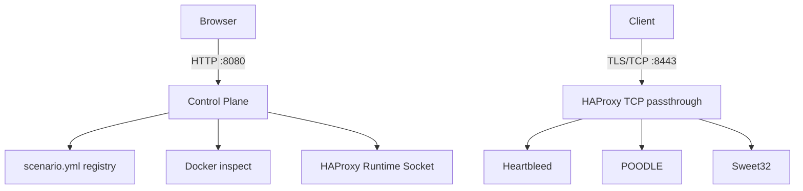

# 密码应用技术漏洞环境自动化配置平台

> **仅限隔离的教学、安全研究和密码靶场。绝不可暴露到公共互联网。** 这是一个有意运行历史 TLS 配置的实验室，绝不是生产安全配置。

该 MVP 将三个预热 TLS 场景置于内部 Docker 网络中。浏览器通过 Spring Boot 控制面选择场景；HAProxy 在 TCP 四层透传 TLS，并通过 Runtime API 即时改变唯一可用的后端，无需重启 Spring Boot、HAProxy 或重建镜像。



## 三层架构

- **Control Plane**：Spring Boot、YAML 场景注册、H2 审计、Docker 只读状态查询和 HAProxy Runtime API。
- **Data Plane**：HAProxy `mode tcp`，不解密 TLS；主机只发布 `8443`。
- **Vulnerability Plane**：三个独立容器和镜像，仅在 `crypto-lab-network` 中，均不发布宿主机端口。

## 场景与真实性

| 场景 | CVE | 实现 |
|---|---|---|
| Heartbleed | CVE-2014-0160 | 使用历史 OpenSSL 1.0.1f 的真实 Heartbeat 漏洞实现。|
| POODLE | CVE-2014-3566 | 历史 OpenSSL 服务器明确启用 SSLv3，真实复现其协议前提。|
| Sweet32 | CVE-2016-2183 | 历史 OpenSSL TLS 服务仅允许 `DES-CBC3-SHA`，真实复现 64 位分组密码前提。|

为稳定构建，三个镜像均从 OpenSSL 1.0.1f 源码编译；这层 Docker 兼容封装是教学部署措施，不是伪造 HTTP 接口。`openssl s_server -www` 提供的是**经 TLS 加密后的**测试响应，HAProxy 始终只转发原始 TLS 字节。

## 启动时自定义密码误用参数

每个场景包含一个 `vulnerability.env`。它只允许配置 `scenario.yml` 中 `vulnerabilityOptions` 声明过的密码误用选项；未声明值和白名单外值会导致控制面或场景容器快速失败，避免命令注入和配置拼写错误。

默认配置为：

```text
scenarios/heartbleed/vulnerability.env  HEARTBLEED_TLS_PROFILE=tls1_2
scenarios/poodle/vulnerability.env      POODLE_PROTOCOL=ssl3
scenarios/sweet32/vulnerability.env     SWEET32_CIPHER=DES-CBC3-SHA
```

例如，将 POODLE 改成 TLS 1.0 对照配置：

```dotenv
POODLE_PROTOCOL=tls1
```

参数在漏洞容器初始化时读取，因此修改后只需重建对应场景容器：

```bash
docker compose up -d --force-recreate poodle
```

这不会重启 Spring Boot 或 HAProxy。之后页面上的场景切换仍然使用 Runtime API，无需重启任何服务。前端场景卡片会显示有效参数，以及它当前是否满足声明的漏洞条件。未来接入网银等场景镜像时，可以继续声明 `keyMode`、`ivMode`、`cipherMode` 等选项；密钥或 IV 原文应设置 `sensitive: true`，API 会掩码且不返回允许值。

## 前置条件和启动

安装 Docker Engine / Docker Desktop（含 Compose v2），在此目录执行：

```bash
docker compose up -d --build
docker compose ps
```

打开控制台：[http://localhost:8080](http://localhost:8080)。实验 TLS 入口为 `localhost:8443`。首个构建会下载并编译旧版 OpenSSL，可能耗时数分钟。

## API 与切换

```bash
curl http://localhost:8080/api/scenarios
curl -X POST http://localhost:8080/api/scenarios/poodle/activate
curl http://localhost:8080/api/scenarios/current
curl http://localhost:8080/api/system/status
curl http://localhost:8080/api/audit/logs
```

默认 Heartbleed 为 `ACTIVE`；在页面点击 POODLE 或 Sweet32，或调用对应 `POST /api/scenarios/{id}/activate`。响应包含上一个和当前场景。前端显示容器健康、HAProxy 状态、`ACTIVE`/`STANDBY` 和最近审计记录。

HAProxy 的 `stats socket /var/run/haproxy/admin.sock` 通过名为 `haproxy-runtime` 的共享卷提供给控制面。Java 17 的 Unix Domain Socket 客户端发送 `set server crypto_scenarios/<server> state ready|maint`，之后读取 `show stat` 验证。没有修改 `haproxy.cfg`，没有 reload/restart。应用以公平锁串行化本进程的切换；失败时恢复原后端。

## 验证与测试

```bash
cd control-plane && mvn test
cd .. && ./scripts/smoke-test.sh
cd .. && ./scripts/runtime-status.sh
cd .. && ./scripts/e2e-acceptance.sh
docker compose logs --since=2m haproxy   # 验证没有 HAProxy 重启
docker compose logs --since=2m crypto-control # 验证控制面没有重启
```

Windows PowerShell 可直接运行：

```powershell
./scripts/e2e-acceptance.ps1
```

停止 POODLE 后，控制台会显示 `UNHEALTHY` 且禁用切换；重新启动后其 Docker health check 恢复即可再次切换：

```bash
docker stop crypto-poodle
docker start crypto-poodle
docker compose down
```

## 网络和权限边界

`crypto-lab-network` 是 internal network；控制面仅加入独立的 `control-network`，HAProxy 同时加入两者，漏洞容器仅加入前者。因此漏洞容器无法直接访问控制面或宿主机网络。`control-network` 不是 internal，以兼容 Docker Desktop 的宿主机端口发布；它不包含任何漏洞容器。每个漏洞容器使用 `cap_drop: ALL`、`no-new-privileges`、只读根文件系统、临时 `/tmp`、CPU/内存/PID 限制，且没有 `privileged`、host network、宿主机目录或 Docker Socket。

Docker Socket 是高权限资源，**只**挂载给控制面，以便 MVP 查询已由 Compose 创建的容器，绝不挂载给实验容器。控制平面被攻陷可等同于 Docker 主机风险；在更高保证部署中，应以只读受限 Docker API 代理替换此挂载。HAProxy Runtime Socket 同样仅在控制面与 HAProxy 间共享。

## 项目布局

```text
crypto-lab/
  control-plane/       Spring Boot 3 / Java 17 / H2 / 前端静态资源
  haproxy/             TCP passthrough 与 Runtime Socket 配置
  scenarios/           三个独立镜像、启动脚本和 scenario.yml
  scripts/             smoke test、系统状态脚本
  docs/                架构和场景声明规范
```

本地 Maven 单元测试覆盖 YAML 装载/重复 ID、Runtime API 解析、安全切换、目标不健康拒绝、异常回滚、并发序列化与验证。验证链路会同时检查：目标容器健康、目标后端 READY、HAProxy 仅有一个 ACTIVE 后端且必须等于目标场景、统一入口可达。`/api/system/status` 会返回三类系统状态与每个场景的容器健康、HAProxy 后端状态、ACTIVE/STANDBY 标识，便于前端和脚本统一消费。如果当前主机尚未启动 Docker daemon，请先启动后再执行 `docker compose up -d --build` 与 `./scripts/e2e-acceptance.sh`。
