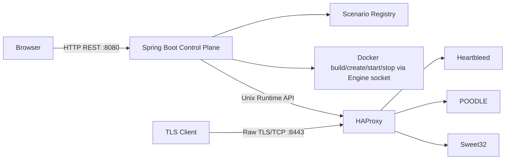

# 架构

控制面负责按需创建和回收场景容器，并写入 HAProxy Runtime Socket；它不在 TLS 流量路径中。HAProxy 为四层 TCP passthrough，不终止或解密 TLS。三个实验容器只加入 `crypto-lab-network`，无宿主机端口、无 Docker Socket、无特权模式。

启动时 HAProxy 的三个后端全部为 `disabled/MAINT`。切换请求由公平锁串行化：校验参数、将目标摘流、按参数重建目标容器、将其他路由置为 `MAINT`、将目标置为 `READY`，最后验证唯一活动后端和统一入口。成功后再按用户选择停止旧容器；失败时恢复先前后端并写入审计日志。
