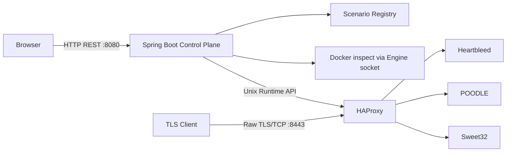

# 架构

控制面只读取容器状态并写入 HAProxy Runtime Socket；它不在 TLS 流量路径中。HAProxy 为四层 TCP passthrough，不终止或解密 TLS。三个实验容器只加入 `crypto-lab-network`，无宿主机端口、无 Docker Socket、无特权模式。

切换时进程内公平锁串行化请求。服务先确认目标容器健康，设置旧路由为 `MAINT`，再将目标设为 `READY`；若 Runtime API 或验证失败，则尝试恢复先前后端，并写入审计日志。状态同步只报告漂移，绝不自动更改实验流量。
